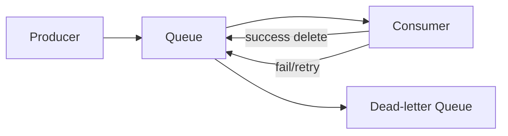

# Amazon SQS

## What It Is

Amazon Simple Queue Service (SQS) is a managed message queue for decoupling producers and consumers.

## Why It Exists

Distributed systems need buffering, retry isolation, and asynchronous communication between components. SQS absorbs spikes and lets producers and consumers move at different speeds.

## Core Concepts

- Standard queue
- FIFO queue
- Visibility timeout
- Dead-letter queue
- Long polling
- Message retention

## How It Works

A producer sends messages to a queue. Consumers poll the queue, process messages, and delete them after success. If processing fails or times out, the message becomes visible again.

## When To Use

Use SQS to decouple services, absorb traffic spikes, and build reliable background job processing.

## When Not To Use

If you need push-based fan-out to many subscribers, use [[Amazon SNS]]. If you need event routing logic, use [[Amazon EventBridge]]. If you need replayable streaming semantics, consider [[Amazon Kinesis]].

## Common Use Cases

- Order processing
- Async image or document processing
- Buffering between microservices
- Lambda event sources

## Security And Operations Considerations

Encrypt queues with KMS if needed. Monitor age of oldest message and DLQ depth. Consumers must be idempotent because repeated delivery can occur.

## Common Mistakes

- Forgetting idempotency for repeated delivery
- Wrong visibility timeout
- No dead-letter queue
- Assuming FIFO is a drop-in replacement for high-throughput standard queues

## Practical Example

An API accepts uploads quickly, stores metadata, and puts a job on SQS. Worker Lambdas process files asynchronously so the user-facing request stays fast.

## Related Notes

- [[Amazon SNS]]
- [[Amazon EventBridge]]
- [[AWS Step Functions]]
- [[Amazon CloudWatch]]
