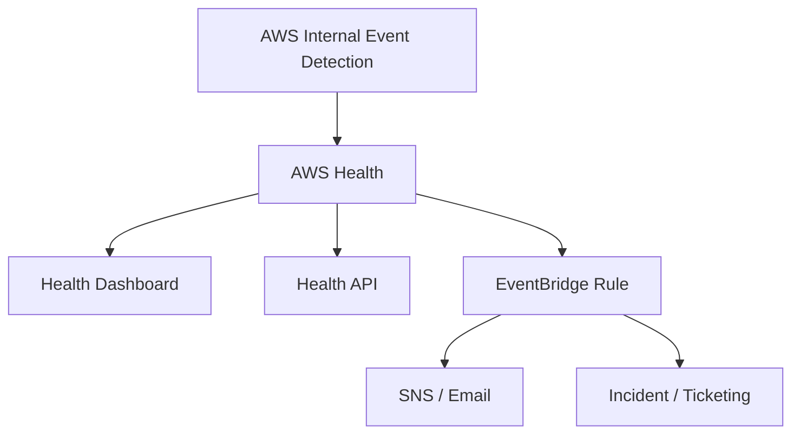

# AWS Health

## What It Is

AWS Health provides ongoing visibility into AWS service events and account-specific operational issues affecting your AWS resources.

## Why It Exists

General AWS status pages show broad service events, but teams also need account-specific impact information, scheduled maintenance notices, and operational warnings tied to their own resources.

## Core Concepts

- Service health events
- Account-specific events
- Scheduled changes
- Health Dashboard and API
- Organizational view

## How It Works

AWS detects a service event, maintenance requirement, or resource-impacting issue and surfaces it in the dashboard or API. You can route Health events through EventBridge, SNS, chat, or incident tools.

## When To Use

Use AWS Health for monitoring AWS-originated incidents affecting your workloads, tracking scheduled maintenance, and centralizing AWS operational notifications.

## When Not To Use

Do not use it as your primary application monitoring system or as a replacement for CloudWatch alarms or Config compliance checks.

## Common Use Cases

- Alerting when an EC2 instance has scheduled retirement
- Tracking RDS maintenance windows
- Notifying operations teams of regional AWS issues

## Security And Operations Considerations

Health events may reveal resource identifiers and account impact. Restrict access with IAM and integrate Health events into existing incident response processes.

## Common Mistakes

- Relying only on the public AWS status page
- Not automating notifications from Health events
- Treating every Health event as a production outage
- Ignoring scheduled change events until too late

## Practical Example

AWS Health emits an account-specific event saying a production EC2 instance is scheduled for retirement. EventBridge forwards it to SNS and Jira so the infrastructure team can replace the instance before the deadline.

## Related Notes

- [[Amazon CloudWatch]]
- [[AWS Systems Manager]]
- [[AWS Control Tower]]
