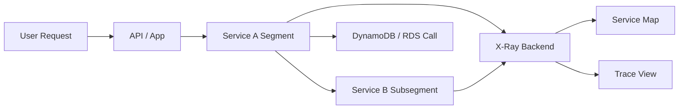

# AWS X-Ray

## What It Is

AWS X-Ray is a distributed tracing and application analysis service for understanding how requests move through distributed systems such as microservices, serverless applications, containers, and traditional applications.

## Why It Exists

Logs and metrics show parts of the picture, but not the end-to-end path of a single request. X-Ray helps you understand where time was spent and which dependency failed.

## Core Concepts

- Trace
- Segment
- Subsegment
- Trace ID
- Sampling
- Service map
- Annotations and metadata

## How It Works

Instrumented applications emit trace context and segment data. X-Ray stitches them into end-to-end traces and shows service maps and timing breakdowns.

## When To Use

Use X-Ray for debugging latency in microservices, tracing serverless request flows, and investigating intermittent production failures.

## When Not To Use

Do not use it as a log management platform or as a replacement for metrics and alarms.

## Common Use Cases

- API Gateway to Lambda to DynamoDB tracing
- ECS or EKS microservice dependency mapping
- Root cause analysis for intermittent 5xx errors
- Identifying slow external API calls

## Security And Operations Considerations

Avoid storing secrets or sensitive payloads in trace annotations or metadata. Sampling configuration matters because tracing every request in production is often unnecessary and expensive.

## Common Mistakes

- Expecting X-Ray to replace CloudWatch Logs
- Capturing sensitive data in trace fields
- Not propagating trace headers across services
- Tracing only one service and expecting end-to-end visibility

## Practical Example

A checkout API becomes slow during peak traffic. The team enables tracing on API Gateway, Lambda, and downstream database calls, opens the X-Ray service map, and finds that most latency comes from an external payment API.

## Related Notes

- [[Amazon CloudWatch]]
- [[AWS Lambda]]
- [[Amazon ECS]]
