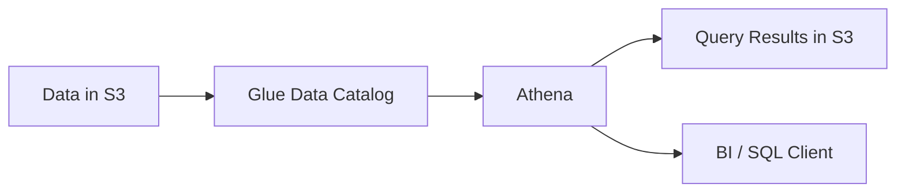

# Amazon Athena

## What It Is

Amazon Athena is a serverless interactive query service that lets you analyze data in Amazon S3 using standard SQL.

## Why It Exists

Many teams store large volumes of data in S3 but do not want to operate a database cluster just to query it. Athena provides pay-per-query analytics and fast ad hoc exploration.

## Core Concepts

- Serverless SQL
- Data in S3
- Schema-on-read
- Tables and databases in Glue Data Catalog
- Partitions
- Columnar formats
- Workgroups

## How It Works

Data lands in S3, metadata is defined in Glue Data Catalog or manually, Athena reads matching S3 objects, and query results are written back to S3.

## When To Use

Use Athena for ad hoc analysis on data already in S3, log analytics, lightweight reporting, and data lake exploration.

## When Not To Use

Do not use it for high-concurrency transactional workloads, low-latency OLTP applications, or frequent small queries over badly formatted raw text.

## Common Use Cases

- Security log investigations
- Cost and billing analysis exports
- Data lake exploration
- BI dashboards on moderately sized datasets

## Security And Operations Considerations

Use IAM, Lake Formation, and S3 policies to control access. Partition data by common filter dimensions and prefer Parquet or ORC over CSV or JSON for large datasets.

## Common Mistakes

- Querying huge CSV files without partitioning
- Forgetting that query results are stored in S3
- Using Athena for transactional app queries
- Ignoring schema drift in semi-structured data

## Practical Example

You need to investigate failed API requests from ALB logs stored in S3. You create an Athena table, partition by date, and run SQL to find the top failing paths and client IPs.

## Related Notes

- [[AWS Glue]]
- [[AWS Lake Formation]]
- [[Amazon Redshift]]
