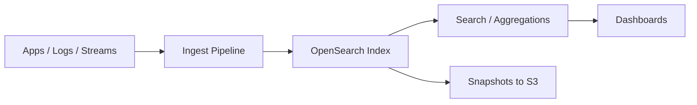

# Amazon OpenSearch Service

## What It Is

Amazon OpenSearch Service is a managed search and analytics service used for log analytics, full-text search, observability, security analytics, and near real-time querying of indexed data.

## Why It Exists

Search and analytics engines are operationally heavy. OpenSearch Service provides managed search clusters, log and event analytics, and fast text search without self-managing the cluster.

## Core Concepts

- Domain
- Index
- Document
- Shard
- Replica
- Dashboards
- Mappings
- Snapshots

## How It Works

Data is ingested from applications, streams, or ETL jobs, indexed, and then searched or aggregated through APIs and dashboards.

## When To Use

Use OpenSearch for full-text search over application content, centralized log analytics, security event analysis, and faceted search.

## When Not To Use

Do not use it as a primary transactional database, for strong relational joins, or as a cheap archive for infrequently queried raw data.

## Common Use Cases

- Searching product catalogs
- Analyzing application and infrastructure logs
- Security event analysis
- Time-series operational dashboards

## Security And Operations Considerations

Use VPC access, security groups, IAM, and encryption. Poor shard sizing causes instability and waste. Index lifecycle management matters for time-series data.

## Common Mistakes

- Using default mappings without planning field types
- Creating too many small shards
- Sending every log field as indexed text
- Treating OpenSearch like a general-purpose database

## Practical Example

A team ships logs from ECS to OpenSearch, builds dashboards for error counts and latency trends, and searches by request ID during incidents.

## Related Notes

- [[Amazon CloudWatch]]
- [[Amazon Athena]]
- [[AWS Glue]]
