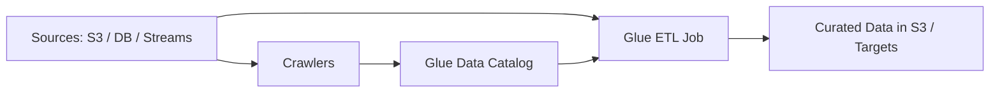

# AWS Glue

## What It Is

AWS Glue is a managed data integration service for discovering, cataloging, transforming, and moving data for analytics, data lakes, and ETL or ELT pipelines.

## Why It Exists

Data is often scattered across S3, databases, streams, and applications, with inconsistent structure and quality. Glue provides central metadata cataloging and managed ETL.

## Core Concepts

- Glue Data Catalog
- Crawler
- ETL job
- DynamicFrame
- Job bookmarks
- Triggers and workflows
- Streaming ETL

## How It Works

Data is discovered by crawlers or registered manually, metadata is stored in Glue Data Catalog, ETL jobs transform source data, and downstream systems consume the results.

## When To Use

Use Glue for managed ETL pipelines, cataloging data lake assets, transforming raw data into curated analytics formats, and scheduled batch data integration.

## When Not To Use

Do not use Glue for simple one-off file copies, ultra-low-latency stream processing with strict millisecond requirements, or tiny datasets where a lightweight script is enough.

## Common Use Cases

- Converting raw JSON or CSV into partitioned Parquet in S3
- Crawling S3 datasets into a central catalog
- Joining application data with reference datasets
- Preparing data for Athena or Redshift

## Security And Operations Considerations

Use IAM roles for jobs and crawlers, encrypt data, and validate crawler output because schema inference can be wrong. Partition strategy should be designed, not accidental.

## Common Mistakes

- Treating crawler output as always correct
- Writing too many tiny files to S3
- Running full reloads when incremental processing is possible
- Forgetting to manage schema evolution explicitly

## Practical Example

A company receives raw clickstream JSON in S3. A Glue crawler catalogs the raw dataset, a Glue ETL job standardizes timestamps and nested fields, and the output is written as partitioned Parquet for Athena.

## Related Notes

- [[Amazon Athena]]
- [[AWS Lake Formation]]
- [[Amazon EMR]]
