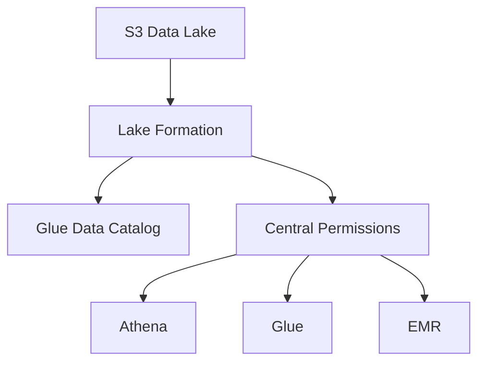

# AWS Lake Formation

## What It Is

AWS Lake Formation is a service for building, securing, and governing data lakes on AWS. It adds centralized permission management and governance over data stored in services such as S3 and the Glue Data Catalog.

## Why It Exists

Data lakes often become hard to manage because storage permissions, table permissions, and cross-service access controls are fragmented. Lake Formation centralizes fine-grained lake permissions.

## Core Concepts

- Data lake administrators
- Data locations
- Databases and tables
- Lake Formation permissions
- LF-Tags
- Data filters
- Governed tables

## How It Works

S3 locations are registered with Lake Formation, metadata is stored in Glue Data Catalog, and admins grant access at database, table, column, or tag level.

## When To Use

Use Lake Formation when you need centralized permissions for a multi-team data lake, fine-grained table or column access controls, and consistent governance across analytics tools.

## When Not To Use

Do not use it for small single-team datasets with simple bucket policies or as a general IAM replacement outside the data lake context.

## Common Use Cases

- Restricting PII columns to approved teams
- Granting analysts access only to specific subject areas
- Managing data access across multiple business units

## Security And Operations Considerations

Lake Formation improves least-privilege governance but must be designed carefully. Review interactions among IAM, S3, Glue, and Lake Formation permissions.

## Common Mistakes

- Assuming Lake Formation alone grants storage access without considering IAM and S3
- Mixing ad hoc grants with no governance model
- Not defining data ownership and stewardship

## Practical Example

A central data platform stores customer, finance, and operational data in one S3 lake. Lake Formation registers the S3 paths, Glue catalogs the data, and LF-Tags control which teams can see finance or PII columns in Athena.

## Related Notes

- [[AWS Glue]]
- [[Amazon Athena]]
- [[Amazon EMR]]
