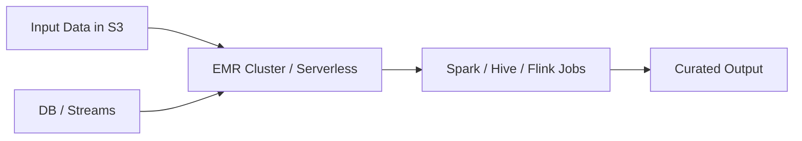

# Amazon EMR

## What It Is

Amazon EMR is a managed big data platform for running distributed processing frameworks such as Hadoop, Spark, Hive, HBase, Flink, and Trino or Presto.

## Why It Exists

Large-scale data processing often needs cluster computing, but building and managing those clusters manually is complex. EMR provides managed big data clusters and elastic compute for batch and stream processing.

## Core Concepts

- Cluster
- Node roles
- EMR steps
- Instance groups and fleets
- EMR on EC2
- EMR Serverless
- EMR on EKS
- Spot instances

## How It Works

You choose a deployment mode, feed input data from S3, streams, or databases, and run distributed frameworks that write output back to storage or downstream services.

## When To Use

Use EMR for large-scale Spark ETL, distributed analytics requiring framework control, streaming and batch pipelines with open-source ecosystem tools, and workloads needing custom dependencies.

## When Not To Use

Do not use EMR for simple ad hoc SQL on S3 where Athena is enough, small ETL jobs better handled by Glue, or low-latency transactional application workloads.

## Common Use Cases

- Daily Spark jobs over terabytes or petabytes of data
- Feature engineering pipelines
- Log processing at scale
- Data science preprocessing
- Streaming aggregations with Flink

## Security And Operations Considerations

Version selection matters for framework compatibility. Cluster right-sizing, autoscaling, and storage planning are ongoing tasks. Spot instances can reduce cost but introduce interruption risk.

## Common Mistakes

- Keeping clusters running when no jobs are queued
- Using EMR when Athena or Glue would be simpler
- Poor Spark partitioning and shuffle design
- Storing output in too many tiny files

## Practical Example

A data engineering team transforms 20 TB of raw clickstream data nightly using Spark on EMR, then writes partitioned Parquet back to S3 for Athena queries the next morning.

## Related Notes

- [[AWS Glue]]
- [[Amazon Athena]]
- [[Amazon Redshift]]
