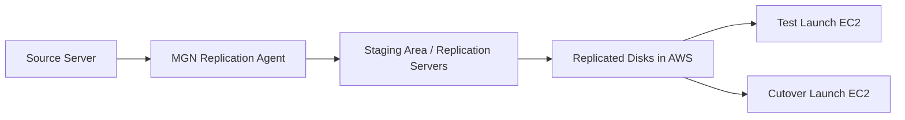

# AWS Application Migration Service (MGN)

## What It Is

AWS Application Migration Service (MGN) is a lift-and-shift migration service for moving physical, virtual, and cloud-based servers to AWS with minimal source changes.

## Why It Exists

Rehosting servers manually is slow and risky. Teams need repeatable migration with continuous replication, testing, and cutover support.

## Core Concepts

- Source server
- Replication agent
- Continuous replication
- Staging area subnet
- Replication servers
- Launch template
- Test launch
- Cutover launch

## How It Works

You install the replication agent on source servers, replicate changed blocks into AWS staging resources, launch test instances for validation, and then perform a final cutover launch.

## When To Use

Use MGN for rehosting applications with minimal redesign, large-scale server migration to EC2, data center exit projects, and fast migrations where modernization comes later.

## When Not To Use

Do not use MGN when the goal is immediate refactoring to cloud-native services, for database-native migrations better handled by DMS, or when the application depends on unsupported hardware or OS characteristics.

## Common Use Cases

- Migrating VMware workloads to EC2
- Moving legacy app servers from a data center to AWS
- Rehosting disaster recovery environments into AWS

## Security And Operations Considerations

Control agent installation and AWS access roles carefully. Test launches are critical. Right-size target EC2 instances and storage after testing. Plan wave sequencing around application dependencies.

## Common Mistakes

- Treating rehosted servers as fully modernized workloads
- Skipping test launches and discovering issues only at cutover
- Ignoring dependency order between application tiers
- Not resizing instances after migration

## Practical Example

A company migrates a three-tier internal application from VMware to AWS by installing MGN agents, validating test launches in an isolated VPC, updating launch templates, and executing cutover during a maintenance window.

## Related Notes

- [[AWS Migration Hub]]
- [[AWS Database Migration Service (DMS)]]
- [[Amazon EC2]]
