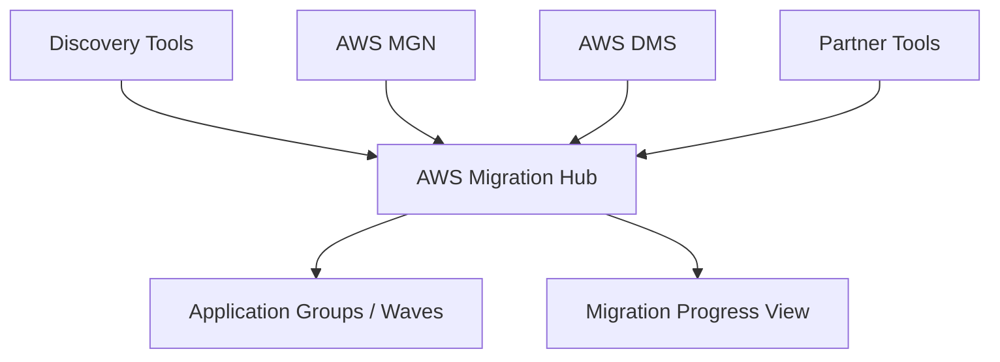

# AWS Migration Hub

## What It Is

AWS Migration Hub is a central service for tracking and managing application migration progress across multiple AWS and partner migration tools.

## Why It Exists

Migration programs often involve many servers, databases, teams, and tools. Without a central view, status tracking becomes fragmented.

## Core Concepts

- Application grouping
- Migration waves
- Progress tracking
- Tool integration
- Discovery data
- Home Region

## How It Works

Discovery tools collect inventory and dependency information, applications and servers are grouped in Migration Hub, and migration tools report status updates into the hub.

## When To Use

Use Migration Hub for large migration programs with many applications, multi-wave migration tracking, or environments using several migration tools.

## When Not To Use

Do not use it as the actual engine that migrates servers or databases. It is a tracking layer, not the migration execution tool.

## Common Use Cases

- Tracking hundreds of servers migrating to AWS
- Grouping applications for wave planning
- Reporting migration KPIs to leadership

## Security And Operations Considerations

Discovery and migration metadata can be sensitive. Good application grouping matters more than raw server lists, and stale discovery data quickly reduces trust in dashboards.

## Common Mistakes

- Treating Migration Hub as the migration tool instead of the tracking layer
- Failing to group assets by application and dependency
- Letting discovery data go stale

## Practical Example

An enterprise is moving 300 on-prem servers. Discovery tooling maps the environment, teams group servers into 25 applications, and Migration Hub organizes the apps into five migration waves while MGN and DMS report execution progress.

## Related Notes

- [[AWS Application Migration Service (MGN)]]
- [[AWS Database Migration Service (DMS)]]
